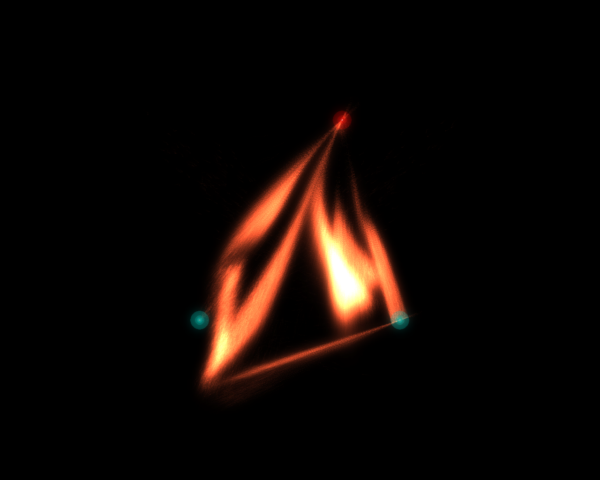
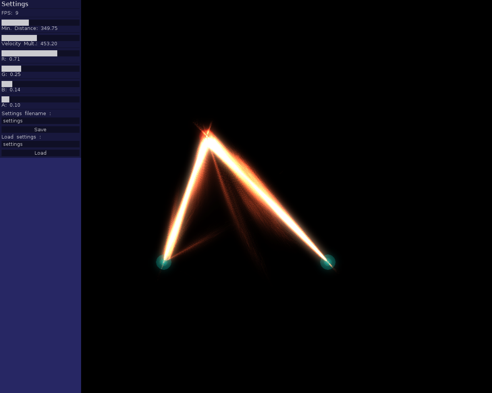

Visual part of the AST interactive diabolo project
==================================================

This program is part of a project we realized as master students.
The goal of the project was to make an interactive diabolo, and this program is the visual part of the project.

The diabolo and the person's arms are tracked using a program available [here](https://github.com/elaye/AST_diabolo_tracking) and the positions of the diabolo and the arms are sent to this program via OSC.
However, you can test the particle system as you can move the attractors with the mouse.

The particle system is configurable with a GUI. You can change the color and opacity of the particles. You can also change some properties of the attractors. Configurations can be saved and loaded with XML files.

Installation
------------

This is an openFrameworks program so you need to put it in the `myApps` directory of openFrameworks to make it work.
Then you just need to compile it with Make:

    make Release

And run it with:

    make RunRelease

It uses the `ofxOsc` addon so it must be present in the `addons` directory of your openFrameworks directory.
It also uses unofficial addons given in the addons directory of the project to avoid version compatibility issues.
